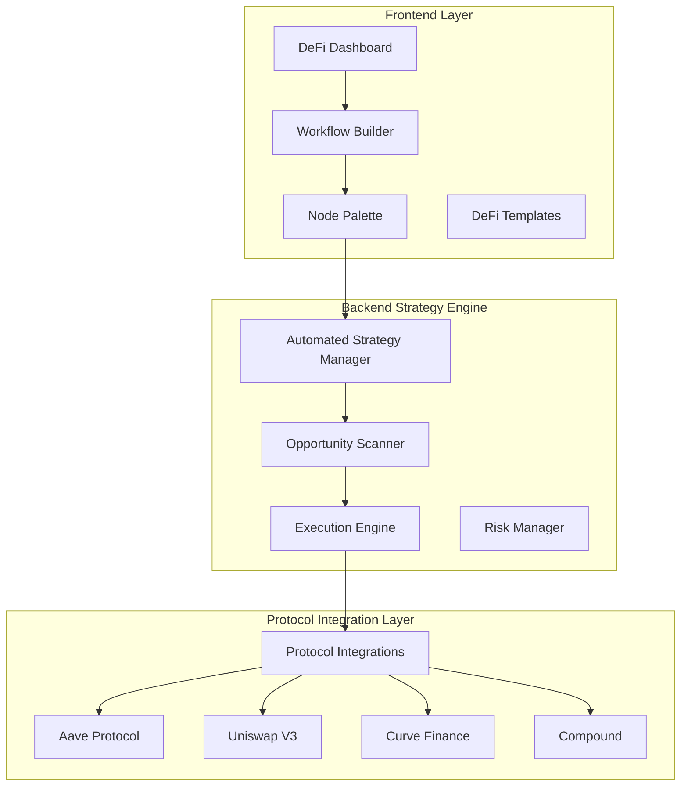
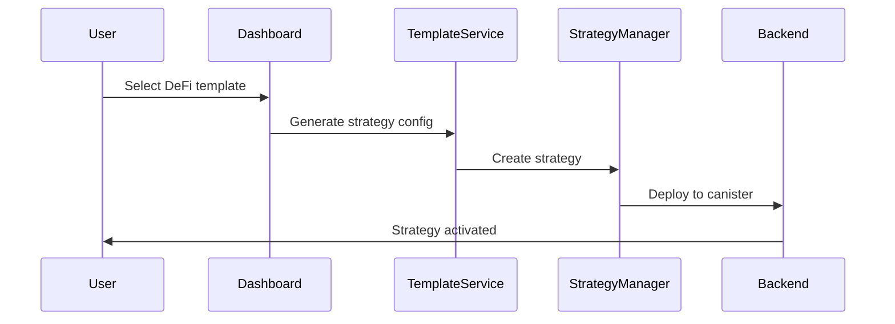
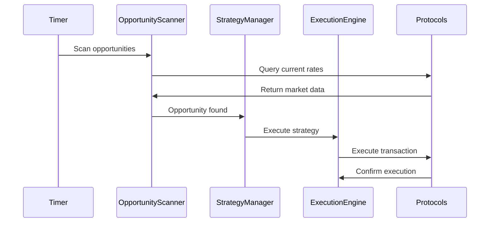
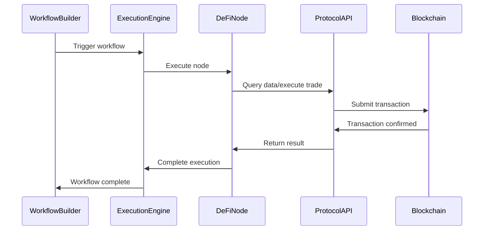

# DeFlow DeFi Nodes - Complete System Architecture Documentation

## 🏗️ Overview

DeFlow's DeFi nodes system is a comprehensive, multi-layered architecture that enables users to create automated decentralized finance strategies through a visual workflow builder. The system combines frontend user interface components with backend smart protocol integration and execution engines.

## 📋 Table of Contents

1. [System Architecture](#system-architecture)
2. [DeFi Node Types](#defi-node-types)
3. [Backend Strategy Engine](#backend-strategy-engine)
4. [Frontend Components](#frontend-components)
5. [Security & Access Control](#security--access-control)
6. [Template System](#template-system)
7. [Real-Time Protocol Integration](#real-time-protocol-integration)
8. [Execution Flow](#execution-flow)
9. [API Endpoints](#api-endpoints)
10. [Configuration & Pricing](#configuration--pricing)

## 🏛️ System Architecture

### Three-Layer Architecture



### Core Components

1. **Frontend Interface**: Visual workflow builder with drag-and-drop DeFi nodes
2. **Strategy Engine**: Sophisticated backend logic for automated strategy execution
3. **Protocol Layer**: Real-time integrations with major DeFi protocols

## 🔧 DeFi Node Types

### 1. Trigger Nodes

#### Price Trigger Node
- **Purpose**: Monitor asset prices and trigger workflows when conditions are met
- **Configuration**: 
  - Asset selection (BTC, ETH, USDC, USDT)
  - Condition types (greater_than, less_than, drops_percent, rises_percent)
  - Target value thresholds
- **Output**: Price data and trigger signal
- **Location**: `src/types/defi-nodes.ts:6-60`

**Example Configuration**:
```typescript
{
  asset: 'ETH',
  condition: 'greater_than',
  value: 3000
}
```

### 2. Strategy Action Nodes

#### Yield Farming Node
- **Purpose**: Execute automated yield farming strategies across multiple protocols
- **Supported Protocols**: Aave, Compound, Uniswap V3, Curve
- **Configuration**:
  - Protocol selection
  - Token to farm (USDC, ETH, USDT, DAI)
  - Investment amount
  - Minimum APY threshold
  - Auto-compound option
- **Location**: `src/types/defi-nodes.ts:63-139`

#### Arbitrage Node
- **Purpose**: Execute cross-chain arbitrage opportunities
- **Configuration**:
  - Asset selection (BTC, ETH, USDC)
  - Buy/sell chain selection (Ethereum, Arbitrum, Polygon, Solana, ICP)
  - Minimum profit percentage
  - Maximum trade amount
- **Location**: `src/types/defi-nodes.ts:141-224`

#### Dollar Cost Averaging (DCA) Node
- **Purpose**: Implement systematic investment strategies
- **Configuration**:
  - Target token (BTC, ETH, SOL)
  - Amount per execution
  - Optional price drop threshold for buying dips
- **Location**: `src/types/defi-nodes.ts:227-280`

#### Portfolio Rebalancing Node
- **Purpose**: Maintain optimal asset allocation ratios
- **Configuration**:
  - Target allocations (JSON format)
  - Rebalance threshold percentage
  - Minimum trade amount to avoid dust trades
- **Location**: `src/types/defi-nodes.ts:283-333`

### 3. Condition Nodes

#### Yield Condition Node
- **Purpose**: Evaluate yield opportunities before execution
- **Configuration**:
  - Protocol to check (Aave, Compound, Uniswap V3)
  - Asset selection
  - Minimum APY requirements
- **Location**: `src/types/defi-nodes.ts:336-390`

### 4. Utility Nodes

#### Price Check Node
- **Purpose**: Retrieve current asset prices across chains
- **Supported Assets**: BTC, ETH, USDC, SOL
- **Supported Chains**: Ethereum, Bitcoin, Solana, Arbitrum, ICP
- **Location**: `src/types/defi-nodes.ts:393-441`

#### Gas Optimizer Node
- **Purpose**: Optimize transaction costs across different networks
- **Configuration**:
  - Target chain selection
  - Priority levels (low/medium/high)
  - Maximum gas price limits
- **Location**: `src/types/defi-nodes.ts:444-498`

#### DAO Governance Node
- **Purpose**: Participate in decentralized governance (Pro tier only)
- **Actions**: Vote on proposals, create proposals, delegate voting power
- **Configuration**:
  - DAO contract address
  - Blockchain selection
  - Governance actions
- **Location**: `src/types/defi-nodes.ts:501-611`

## 🚀 Backend Strategy Engine

### Automated Strategy Manager

The core brain of the DeFi system located in `src/DeFlow_backend/src/defi/automated_strategies/mod.rs`.

#### Key Features:

1. **Strategy Creation & Management**
   - Create strategies from templates or custom configurations
   - Validate strategy parameters and risk limits
   - Track strategy performance and execution history

2. **Intelligent Opportunity Matching**
   - Real-time scanning of DeFi opportunities across protocols
   - Multi-criteria filtering based on user preferences
   - Risk-adjusted opportunity ranking

3. **Automated Execution Engine**
   - Execute strategies based on market conditions
   - Multi-strategy coordination to avoid conflicts
   - Comprehensive error handling and retry logic

### Strategy Types Supported

```rust
pub enum StrategyType {
    YieldFarming(YieldFarmingConfig),
    Arbitrage(ArbitrageConfig),
    Rebalancing(RebalancingConfig),
    LiquidityMining(LiquidityMiningConfig),
    DCA(DCAConfig),
    Composite(Vec<CompositeStrategyConfig>),
}
```

### Opportunity Scanner

Located in `automated_strategies/opportunity_scanner.rs`, this component:

- **Real-time Market Analysis**: Continuously scans DeFi protocols for profitable opportunities
- **Risk Assessment**: Evaluates liquidity, smart contract, and market risks
- **Opportunity Ranking**: Uses sophisticated algorithms to rank opportunities by profitability and safety
- **Time-sensitive Detection**: Identifies arbitrage and yield opportunities with expiration tracking

### Performance Tracking

The system tracks comprehensive metrics:

```rust
pub struct StrategyPerformanceMetrics {
    pub total_executions: u32,
    pub successful_executions: u32,
    pub total_pnl: f64,
    pub roi_percentage: f64,
    pub sharpe_ratio: f64,
    pub max_drawdown_percentage: f64,
    pub avg_execution_time_seconds: f64,
    pub total_gas_spent_usd: f64,
    pub win_rate_percentage: f64,
}
```

## 💻 Frontend Components

### DeFi Dashboard (`src/pages/DeFiDashboard.tsx`)

**Purpose**: Central hub for managing DeFi strategies and monitoring portfolio performance.

**Features**:
- Portfolio overview with total value, returns, and active strategies
- Strategy management interface
- Performance metrics visualization
- Integration with template system

### DeFi Templates (`src/components/DeFiTemplates.tsx`)

**Purpose**: Provide pre-built strategy templates for common DeFi use cases.

**Template Categories**:
- Conservative Yield Farming
- Cross-Chain Arbitrage
- Portfolio Rebalancing
- Dollar Cost Averaging

### Custom Strategy Builder (`src/components/CustomStrategyBuilder.tsx`)

**Purpose**: Advanced interface for creating custom DeFi strategies with detailed parameter control.

### Node Palette Integration

DeFi nodes are integrated into the main workflow builder through:
- Visual drag-and-drop interface
- Subscription-based access control
- Real-time validation and configuration

## 🔐 Security & Access Control

### Tiered Access System

The DeFi nodes follow a three-tier subscription model:

#### Standard Tier (Free)
- ❌ **No DeFi node access**
- ❌ All DeFi functionality restricted

#### Premium Tier ($19/month)
- ❌ **Limited DeFi access**
- ❌ Most advanced DeFi features still restricted

#### Pro Tier ($149/month)
- ✅ **Full DeFi suite access**
- ✅ All DeFi nodes and strategies
- ✅ Advanced portfolio management
- ✅ DAO governance participation

### Access Control Implementation

Located in `src/utils/subscriptionUtils.ts`:

```typescript
export const canAccessNodeType = (userTier: string, nodeType: string): boolean => {
  const tierAssignment = getTierAssignment(nodeType);
  return getTierLevel(userTier) >= getTierLevel(tierAssignment);
};
```

### Security Features

1. **Encrypted Wallet Storage**: All wallet data encrypted with AES-GCM
2. **Input Validation**: Comprehensive validation for all DeFi parameters
3. **Rate Limiting**: Token bucket algorithm prevents abuse
4. **Address Validation**: Support for Bitcoin (P2PKH, P2SH, Bech32, Taproot) and Ethereum (EIP-55) addresses
5. **Transaction Replay Protection**: Prevents duplicate transactions
6. **Risk Management**: Automated risk assessment and limits

## 📝 Template System

### Simple Templates (`src/DeFlow_backend/src/defi/simple_workflow_templates.rs`)

Provides basic, user-friendly templates:

1. **Conservative Yield Farming**
   - Low-risk yield farming on established protocols
   - Target APY: 4.5%
   - Risk Score: 3/10

2. **Cross-Chain Arbitrage**
   - Automated arbitrage across chains
   - Target APY: 12%
   - Risk Score: 7/10

3. **Portfolio Rebalancing**
   - Maintain optimal asset allocation
   - Target APY: 6%
   - Risk Score: 5/10

4. **Dollar Cost Averaging**
   - Systematic investment strategy
   - Target APY: 8%
   - Risk Score: 4/10

### Template Manager

```rust
impl SimpleWorkflowTemplateManager {
    pub fn generate_strategy_config(
        &self, 
        template_id: &str, 
        capital_amount: f64
    ) -> Result<StrategyConfig, String>
}
```

## 🔗 Real-Time Protocol Integration

### Protocol Integration Manager

Located in `src/DeFlow_backend/src/defi/protocol_integrations.rs`, handles:

- **Live Yield Opportunities**: Real-time APY data from Aave, Compound, Uniswap V3
- **Arbitrage Scanning**: Cross-chain price differentials
- **Liquidity Analysis**: Available liquidity for large trades
- **Gas Price Optimization**: Dynamic gas pricing across networks

### Supported Protocols

1. **Aave**: Lending and borrowing with variable APY
2. **Uniswap V3**: Concentrated liquidity and swap opportunities  
3. **Compound**: Algorithmic money market protocol
4. **Curve Finance**: Stablecoin and similar asset swaps
5. **Custom Integrations**: Framework for adding new protocols

## ⚡ Execution Flow

### 1. Strategy Creation Flow



### 2. Strategy Execution Flow



### 3. Node Execution in Workflow



## 🔌 API Endpoints

### Strategy Management API (`src/DeFlow_backend/src/defi/strategy_api.rs`)

#### 1. Get Yield Opportunities
- **Endpoint**: `/api/v1/strategy/yield/opportunities`
- **Method**: GET
- **Purpose**: Fetch real-time yield farming opportunities across protocols
- **Response**: Market summary with APY, TVL, and protocol data

#### 2. Scan Arbitrage Opportunities  
- **Endpoint**: `/api/v1/arbitrage/scan`
- **Method**: GET
- **Purpose**: Identify profitable arbitrage opportunities
- **Response**: Cross-chain price differentials and profit potential

#### 3. Portfolio Analytics
- **Endpoint**: `/api/v1/strategy/portfolio/analytics`
- **Method**: GET
- **Purpose**: Comprehensive strategy portfolio analysis
- **Response**: Performance metrics, risk assessment, and recommendations

#### 4. Execute Strategy
- **Endpoint**: `/api/v1/strategies/execute`
- **Method**: POST
- **Purpose**: Create and activate new DeFi strategy
- **Parameters**: User ID, strategy configuration, capital amount

#### 5. Performance Report
- **Endpoint**: `/api/v1/performance/report`
- **Method**: GET
- **Purpose**: Generate detailed performance analytics
- **Response**: ROI, PnL, strategy breakdown, and optimization suggestions

## 💰 Configuration & Pricing

### Tiered Execution Pricing

Each DeFi node supports tiered pricing based on subscription level:

```typescript
tieredPricing: {
  standard: { executionFee: 0.1, description: 'Basic execution with standard speed' },
  premium: { executionFee: 0.05, description: 'Faster execution with priority processing' },
  pro: { executionFee: 0.02, description: 'Fastest execution with advanced features' }
}
```

### Configuration Schema

Each node defines its configuration schema:

```typescript
configSchema: [
  {
    key: 'asset',
    name: 'Asset',
    type: 'select',
    required: true,
    options: [
      { label: 'Bitcoin (BTC)', value: 'BTC' },
      { label: 'Ethereum (ETH)', value: 'ETH' }
    ],
    defaultValue: 'BTC'
  }
]
```

## 📊 Performance & Analytics

### Strategy Analytics

The system provides comprehensive analytics:

```typescript
interface StrategyAnalytics {
  user_id: string;
  total_strategies: number;
  active_strategies: number;
  total_allocated_capital: number;
  total_pnl: number;
  weighted_roi: number;
  best_performing_strategy?: string;
  worst_performing_strategy?: string;
  average_execution_time: number;
  total_gas_spent: number;
}
```

### Risk Metrics

Real-time risk assessment:

```rust
pub struct StrategyRiskMetrics {
    pub volatility_score: f64,
    pub liquidity_risk_score: f64,
    pub concentration_risk_score: f64,
    pub smart_contract_risk_score: f64,
    pub last_risk_assessment: u64,
}
```

## 🔄 Integration with Workflow Builder

### Node Registration

DeFi nodes are registered with the main workflow system:

```typescript
// In NodePalette.tsx
const defiNodes = DEFI_NODE_TYPES.filter(node => 
  canAccessNodeType(subscriptionTier, node.id)
);
```

### Execution Integration

DeFi nodes integrate with the main execution engine:

```typescript
// In ExecutionEngine
case 'yield-farming':
  return await executeDeFiStrategy(node, context);
case 'arbitrage':
  return await executeArbitrageStrategy(node, context);
```

## 🚨 Error Handling & Recovery

### Strategy Error Types

```rust
pub enum StrategyError {
    StrategyNotFound(String),
    ValidationFailed(String),
    ExecutionFailed(String),
    InsufficientCapital(f64),
    RiskLimitExceeded(String),
    OpportunityNotFound,
    ConfigurationError(String),
    IntegrationError(String),
}
```

### Recovery Mechanisms

1. **Automatic Retry Logic**: Failed executions are retried with exponential backoff
2. **Fallback Strategies**: Alternative execution paths when primary fails
3. **Circuit Breakers**: Automatic strategy pause on repeated failures
4. **Manual Intervention**: User can pause/resume/modify strategies

## 📈 Future Roadmap

### Planned Enhancements

1. **Advanced Strategy Types**:
   - Options strategies
   - Leveraged farming
   - Cross-chain yield optimization

2. **Enhanced Protocol Support**:
   - More DEX integrations
   - L2 scaling solutions
   - Cross-chain bridges

3. **AI-Powered Features**:
   - Predictive analytics
   - Automated strategy optimization
   - Market sentiment analysis

4. **Enterprise Features**:
   - Multi-user portfolio management
   - Advanced risk controls
   - Institutional-grade reporting

## 🔧 Development & Testing

### Local Development

1. **Backend Setup**:
   ```bash
   cd src/DeFlow_backend
   dfx start
   dfx deploy
   ```

2. **Frontend Setup**:
   ```bash
   cd src/DeFlow_frontend
   npm install
   npm run dev
   ```

3. **Testing DeFi Nodes**:
   ```bash
   npm run test:defi
   ```

### Integration Testing

Comprehensive test suites cover:
- Node configuration validation
- Strategy execution logic
- Protocol integration mocks
- Error handling scenarios

---

## 📞 Support & Documentation

For additional support or questions about DeFi nodes:

1. **Technical Documentation**: Check inline code comments and type definitions
2. **API Documentation**: Use `/api/v1/docs` endpoint for live API documentation
3. **Health Check**: Monitor system status via `/api/v1/health` endpoint
4. **Error Logs**: Check browser console and canister logs for debugging

---

*Last Updated: January 2025*
*DeFlow Team - Advanced DeFi Automation Platform*